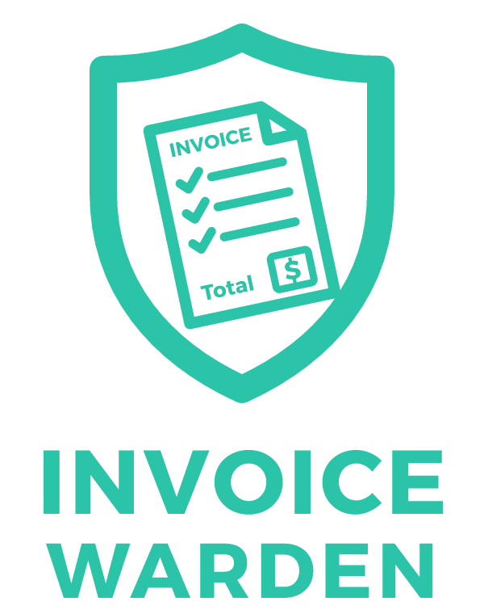

<p align="center"></p>

# InvoiceWarden

**Supplier invoices filed to the right job, straight from your inbox. Nothing to set up with
your suppliers.**

A Windows app from [Sixth Day Studios](https://sixthdaystudios.com) that watches the inbox your
suppliers already send invoices to, reads each invoice with AI (supplier, invoice number, job
number), and attaches it to the matching job in **ServiceM8**. Unlike ServiceM8's own supplier
invoice import, suppliers don't need to send to a special address, and job numbers don't have to
be written as an exact PO number.

Formerly **InvoiceM8** (renamed 2026-10: "M8" clashed with ServiceM8).

## Get it

A single **click-to-run `InvoiceWarden.exe`**: no install and no admin rights, because business
PCs are often locked down. It keeps itself up to date.

- Download: `https://github.com/Mikeyau-ai/InvoiceWarden/releases/latest/download/InvoiceWarden.exe`
- Details and pricing: [sixthdaystudios.com/invoicewarden](https://sixthdaystudios.com/invoicewarden)
- Help: [sixthdaystudios.com/support](https://sixthdaystudios.com/support)

The exe isn't code-signed yet, so Windows SmartScreen shows "Windows protected your PC" the
first time: click **More info**, then **Run anyway**.

## What it works with

| | |
|---|---|
| Email | Microsoft 365 / Outlook.com (sign in), the classic Outlook desktop app, or other email over IMAP (Gmail, Fastmail, iCloud...) |
| Job system | ServiceM8 (simPRO, AroFlo and Fergus are planned) |
| AI | Google Gemini, OpenAI, Anthropic Claude, or any OpenAI-compatible / local server |

Xero, MYOB and QuickBooks Online connections exist in the code but are switched off in the app
until they've been tested against real accounts.

## Using it

1. **Setup wizard** (first start): connect your email, paste your ServiceM8 API key and an AI key,
   each with a Test button and a step-by-step guide.
2. **Activity**: one On/Off switch, invoices filed today and this week, and **Needs attention**
   for anything that couldn't be filed (with Retry). "Go back further…" sweeps older emails.
3. **Suppliers** are added automatically as their first invoice arrives; check them once, and add
   any other names they use ("Also known as").
4. **Settings**: Email, Where invoices go, AI, General, plus a folded Advanced section.

Saved keys and passwords are encrypted with a key held in Windows Credential Manager (DPAPI).
Nothing is sent anywhere except your own email, ServiceM8 and the AI provider you choose.

## Data

`%LOCALAPPDATA%\InvoiceWarden\`: `invoicewarden.sqlite3`, `attachments\`, `logs\`. On first start
after the rename, `%LOCALAPPDATA%\InvoiceM8` is copied here (`core/migrate.py`) and the old folder
is kept as a backup.

## Running from source

```bash
python -m venv .venv
.venv\Scripts\activate
pip install -r requirements.txt
python main.py
```

Python 3.11+, Windows only (pywin32 COM + `winreg`). Tests: `python -m unittest discover -s tests`
(or `run_tests.bat`).

## Build and release

```bash
:: bump version.py + add a CHANGELOG.md entry, commit, then:
release.bat
```

`release.py` runs the tests, then asks two questions:

1. **Build a fresh InvoiceWarden.exe?** PyInstaller against `InvoiceWarden.spec`: one windowed
   `dist\InvoiceWarden.exe` (~100 MB, no Python needed). Build from an environment with the full
   `requirements.txt` so the AI / Graph / attachment libraries are bundled.
2. **Publish it as GitHub release `v<version>`?** Uploads `InvoiceWarden.exe` plus the same build
   as `InvoiceM8.exe`: copies still on the old name only look for that file, so every release
   carries it until they've all updated.

Releases are marked Latest and every copy updates itself to them, including the one in daily use,
so publish only when a build has been checked. Overrides: `--yes`, `--build-only`, `--skip-build`.

Artwork: `python make_icon.py` (icon, wordmark and Store art from one vector drawing).

## Module map

| Area      | Files |
|-----------|-------|
| Entry     | `main.py`, `config.py`, `core/migrate.py` (InvoiceM8 -> InvoiceWarden move) |
| Security  | `core/crypto.py`, `core/settings_store.py` |
| Database  | `core/database.py` |
| Email     | `integrations/email_outlook.py` (COM + Graph), `integrations/email_imap.py` |
| AI parse  | `core/parser_ai.py` (Gemini / OpenAI / Anthropic / compatible + regex fallback) |
| Routing   | `core/router.py`, `core/watcher.py` |
| Providers | `integrations/service/*`, `integrations/accounting/*`, `integrations/registry.py` |
| Startup   | `core/startup.py` (HKCU Run key) |
| Updates   | `core/updater.py`, `gui/update_dialog.py`, `release.py`, `version.py` |
| GUI       | `gui/app.py`, `gui/activity_page.py`, `gui/customers_tab.py`, `gui/settings_tab.py`, `gui/setup_wizard.py`, theme in `gui/theme.py` |
